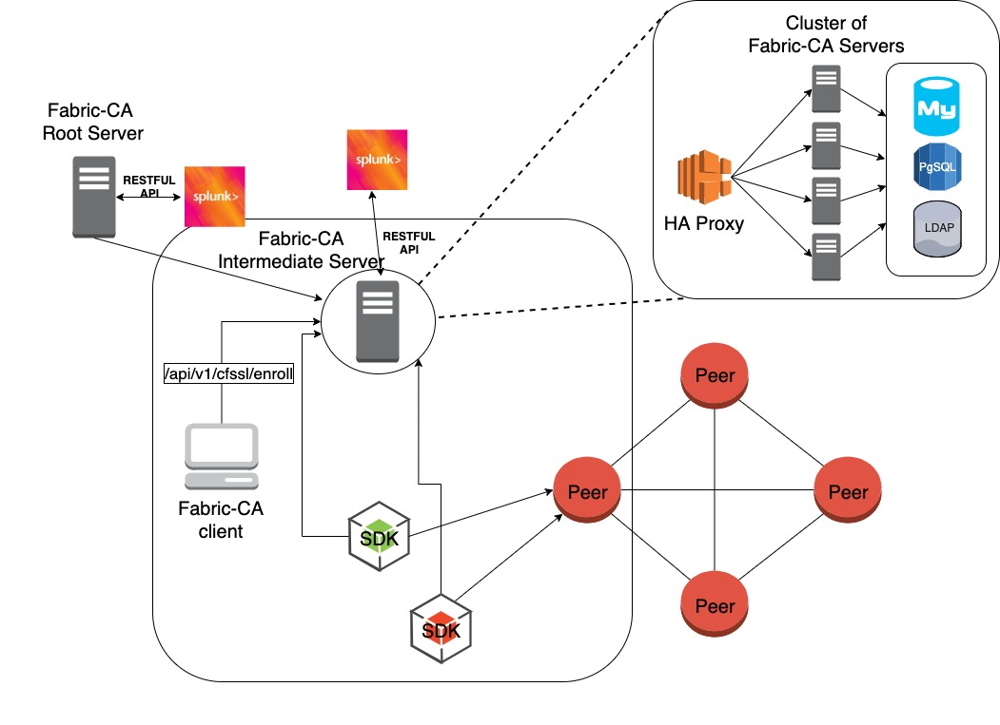
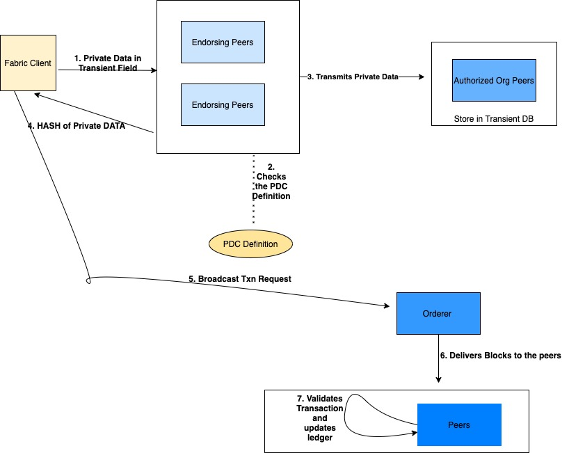
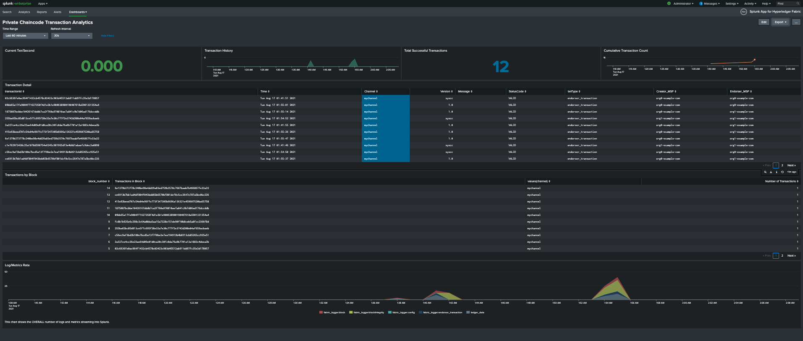
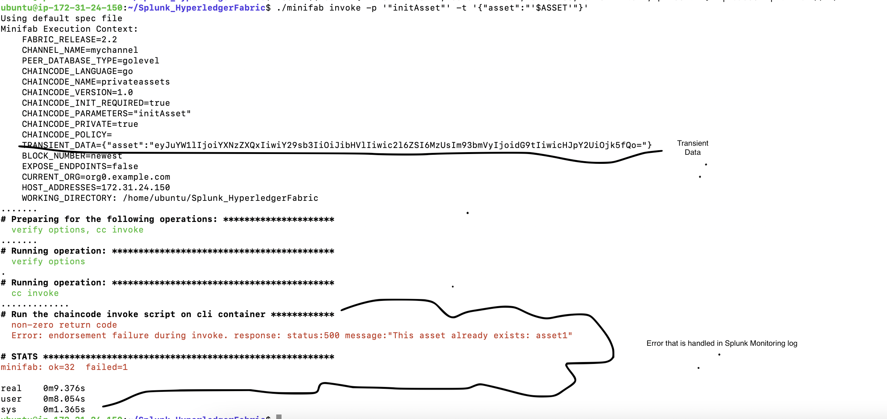

# Hyperledger Fabric Integration with Splunk

## Objective

* The purpose of this repo is to illustrate splunk transaction logging integration with Hyperledger Fabric. This project will take a usecase of **private data transactions** as they are one of the key enterprise blockchain transaction methodologies and analyze the usefullness of splunk/fabric-logger. The README will also analysis the pro's and cons of the splunk fabric-logger.

* Table Of Contents
    - [Analysis: Pro's and Con's](#analysis)
    - [Working demo with minifab and car ownership chaincode](#working-demo)
        - [Explanation of demo and analysis/takeaways of demo](#explanation)
        - [Instructions](#instructions)
    - [Resources](#resources)

### Analysis: 

* Pro's/What I like, that is already built. 
    - I liked the ease of setting up the splunk fabric-logger with both native hyperledger fabric and minifab. By utilizing docker containers
    - Has holistic monitoring/logging aggregator service from infrastructure to blockchain network, so an engineer does not have to setup grafana, prometheus, and hyperledger explorer. 

* Con's/What I would want and how to build it with splunk. 
    - Certificate Monitoring [**Most desired feature**]
        - One of the key issues and critical bugs that Enterprises are facing when in production is the issue of expiring certs. What is happening is that when certs expires such as the admin certs, the organization gets shut out. I would like if splunk can leverage `fabric-ca-server` and peer logs to notify the organization of an upcoming cert expiration and if possible automated reissuance of a cert. This may be possible because *all communication with fabric-ca-server is done through RESTFUL APIs*. 
        - Here is a [link](https://lists.hyperledger.org/g/fabric/topic/criticial_admin_certificate/71743922?p=,,,20,0,0,0::recentpostdate%2Fsticky,,,20,2,0,71743922) to common critical issue faced by many organizations running Hyperledger Fabric or Enterprise Blockchain Applications. 

        - Below is an illustation of solution architecture with splunk integration in regards to fabric-ca-server. 

        
    - Transient Store Monitoring: Most multi-org blockchain applications use some sort of private data mechanism in fabric that mechanism is used by transient store inorder to collect and store private data attributes. It would be nice for splunk integration with transient store which resides in the peer database be it leveldb or couchdb. 

    - When I used fabric-logger with native hyperledger fabric setup replicating a production network. I would of liked these information on the chaincode commit status when debugging or monitoring, 
        - Check commit status of a chaincode (ie: `peer lifecycle chaincode checkcommitreadiness`)
        - This is useful when orgs are on production scale multi machine env and you want to check which org is rejecting it and why. Especially with 2.x since there is a more decentralized approach to transaction flow. 
    - Monitor of fabric network event listener 
        - I would like a bit more monitoring of the `fabric-network-event-listener` as it is commonly used in production grade application applications such as in integrating off-chain-data analysis and oracle development. 

### Working Demo: 

### **Explanation**
#### Splunk transaction integration with Hyperledger Fabric working example using minifab and car ownership chaincode
#### Background Information of the demo
* The importance of this demo is test out how splunk metrics can be leveraged with monitoring chaincode that utilizes PDC or private data. Most enterprise hyperledger fabric applications implement private data to protect internal product information and sensitive information such as PII. 

* One of the key painpoints in monitoring and debugging production based Hyperledger Fabric applications is to find where in the transaction flow the chaincode fails. Below is a diagram that illustrates the **seven** key steps for a private data transaction. 



* As one can see in the architecture diagram above it can be cumbersome to monitor and debug the whole transaction lifecycle of a private transaction in Hyperledger Fabric. For an example if the network components such as the peers are hosted in different machines and storage is done through external volume it can be a tedious process to aggregate all the logs and find isue or create an effective monitoring mechanism. By using the ***custom splunk dashboard*** I was able to mix and match various key indicators to ease debugging and monitoring aspects of blockchain network. 

* Below is screenshot of the private chaincode dashboard. 

* Due to the fact I utilized minifab not native hyperledger fabric for timeconstraints. There were limited metrics I was able to implement as there was no direct access to docker configuration for blockchain network components. Below are the metrics I chose to have to analysis private data transactions. 

- Metrics in Dashboard
    - TXN/Second: This is useful when looking at the latency 
    - Transaction History: Useful when looking at what time has there been a lot of transactions. May be useful when pinpoint heavy transaction errors such as **MVCC errors**
    - Transaction Detail: Quickoverview of how many transactions occured and their status. This can be useful in a dev environment when their are limited transactions and you are pinpointing which type of transactions are failing. 
    - LogMetrics Rate: I chose to have this metric because for cost saving purposes and possible visual representation of network activity. In regards to cost saving, if you are log ingester such as GCP stackdriver or datahog or any external logging service you can see which specific blockchain activity is causing alot of log events and can reduce the logging level. 


- Metrics in Dashboard, I would of liked to implement
    - OrdererTLS connections: For secruity reasons would of been nice to see which peers are connected to the orderer along with the fabric clients. 
    - Transient store monitoring by levaraging couchdb and transient indexes

    **Below is an example of error monitor that is useful with the splunk dashboard and why transient data monitoring is essential**

)


### Instructions

* Note: Please use legacy osxfs file sharing mechanism for MAC. [link](https://github.com/hyperledger-labs/minifabric/issues/141)
* Example using HF 2.2

* Step 1: Run the start script 

> ./start.sh

* Step 2: Run the privateassets script


*The privateassets script will configure, init, approve, invoke, and query the privateassets chaincode.*

> ./privateassets.sh

* Step 3: Open port 8000 on local host or VM ip

* Here is a link to my custom dashboard that is running on a ec2 instance. Could not figure out how to save it locally. 

```text
https://localhost:8000
Username: admin
Password: changeme
```
* Step 4: Terminate the example

> ./stop.sh


### Resources: 

* https://github.com/hyperledger-labs/minifabric
* https://github.com/splunk/fabric-logger
* https://github.com/splunk/fabric-logger/tree/master/examples/minifab
* https://github.com/hyperledger/fabric-samples/tree/main/chaincode/marbles02_private
* https://github.com/splunk/fabric-logger/tree/master/examples/vaccine-demo


